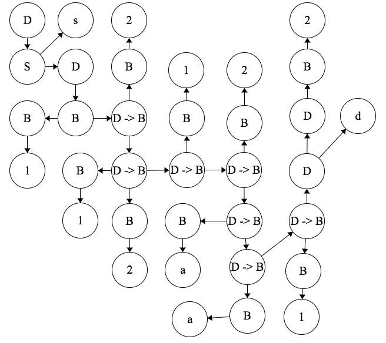
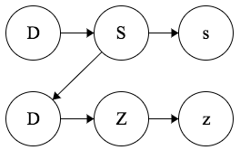
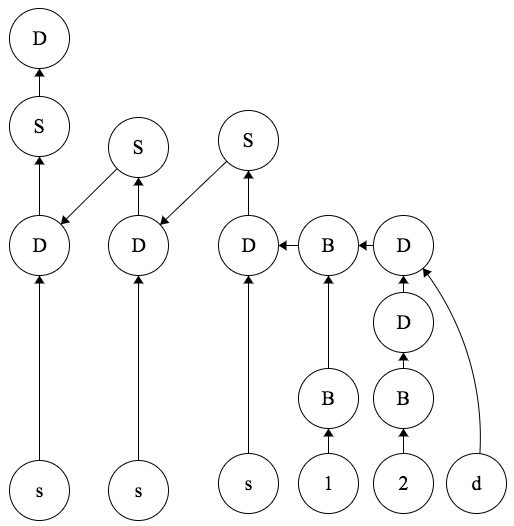
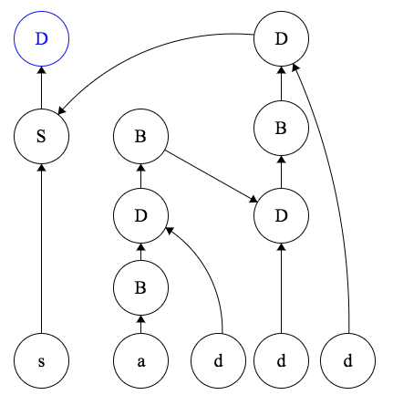
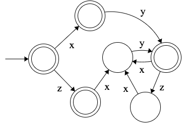

# Sujet TP 1 2018

*difficulté: *, temps correcteur:*

## Grammaire et arbre (9 pts)

```OCaml
Soit G la grammaire suivante :

D -> B |D”d” | S
S -> Z | “s”D
B -> ”1” | ”2” | ”a” | BD
Z -> ”z”
```

### 1.1: Ecrire G sous forme BNF

```OCaml
G = {
    axiome: D,
    terminaux: {"d", "s", "1", "2", "a", "z"},
    non-terminaux: {D, S, B, Z},
    règles: {
        D ::= B | Dd | S,
        S ::= Z | sD,
        B ::= 1 | 2 | a | BD,
        Z ::= z
    }
}
```

### 1.2: Faire l'analyse descendante des locutions L1 et L2 pour vérifier leur appartenance à G

L1 = s121212aa12d -> Appartient bien a G car il existe une dérivation de L1 depuis l'axiome D de G.



L2 = sz21d -> Appartient bien a G il n'y a plus de dérivation possible après Z et une seule dérivation possible de depuis G finissant toujours sur Z dès le deuxième caractère.



### 1.3: Faire l'analyse ascendante des locutions L3 et L4 pour vérifier leur appatenance à G

L3 = sss12d -> Appartient bien à G. Il existe une réduction de la locution en l'axiome D de G.



L4 = saddd -> Appartient bien à G. Il existe une réduction de la locution en l'axiome D de G.



### 1.4: G est-elle ambigüe

Oui G est ambigüe, il exesite plusieur réduction possible pour les expressions de styles BB, SS, ZZ ...

## Expressions et automates (6 pts)

### 2.1: Quelle expression régulière permet d’engendrer les mots du langage suivant L = {ε, z, x, xy, zxy, xyxy, zxyzxy, xyxyxy, zxyzxyzxy, xyxyxyxy, zxyzxyzxyzxy,...} ? Décrivez le langage

(zxy)*|(xy)*|z|x

Le mot vide, les mots z et x et tous les mots multiples (zxy) et (xy)

### 2.2: Faire l'automate de l'ER 2.1



## Expressions Régulière (5pts)

`ER = ((ab)* | cdz)*tr (a)+`

- `M1 = ababababab` -> false. Pas de `rt`.
- `M2 = tratra` -> false. `tr` après un `a`.
- `M3 = abababcdzabtra` -> ok.
- `M4 = cdzcdzacdztra` -> false. `a` avant un `tr`.
- `M5 = abababtraaaaaa` -> ok.
